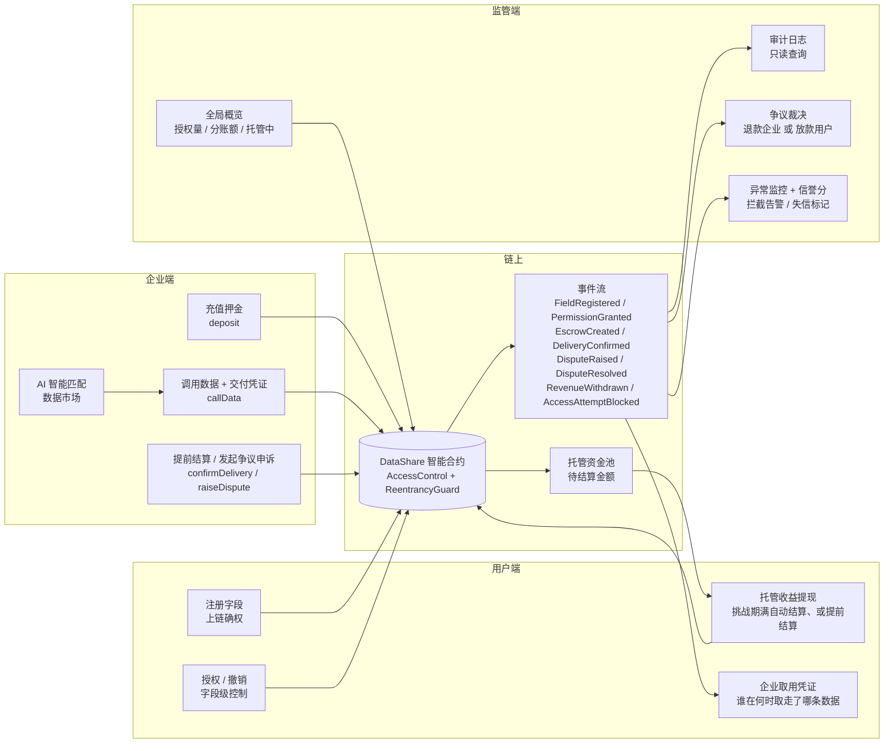
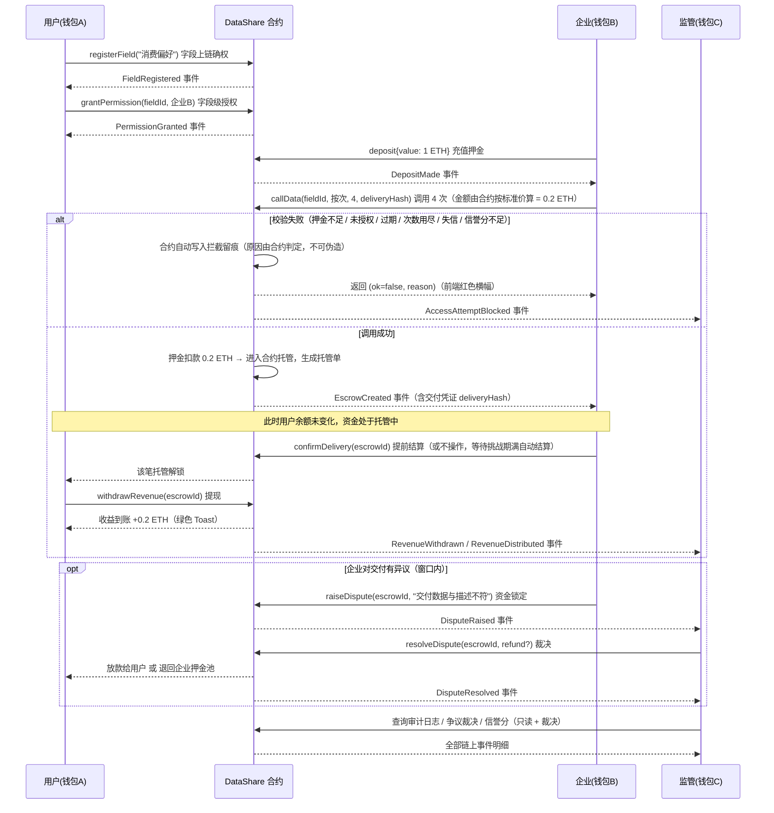
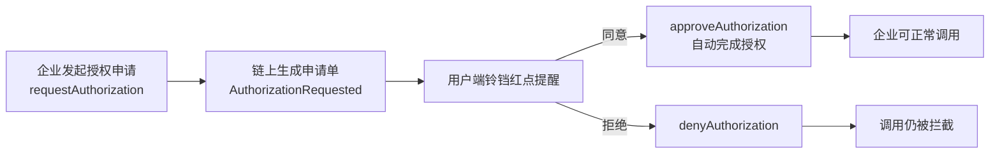

# 链承共予 · DataShare 项目说明文档

> 个人数据授权与收益分账 DApp —— 让数据成为资产，每一次授权都有迹可循
>
> 区块链大赛参赛项目 · 文档版本 v4.5（合约仍为 v4.4） · 更新日期 2026-09-26

---

## 目录

1. [项目概述](#1-项目概述)
2. [市场与政策背景](#2-市场与政策背景)
3. [系统架构](#3-系统架构)
4. [核心功能](#4-核心功能)
5. [业务流程](#5-业务流程)
6. [智能合约设计](#6-智能合约设计)
7. [技术创新点](#7-技术创新点)
8. [合规与安全](#8-合规与安全)
9. [演示与部署](#9-演示与部署)
10. [团队与展望](#10-团队与展望)
11. [链下存储、链上索引架构](#11-链下存储链上索引架构)

---

## 1. 项目概述

### 1.1 一句话简介

**链承共予 · DataShare** 是一个基于区块链的"个人数据授权与收益分账 DApp"：用户将数据字段上链确权，按需授权给企业，企业付费调用，收益自动分账给用户，全程链上留痕、监管可审计。

### 1.2 痛点分析

| 痛点 | 现状描述 |
| --- | --- |
| 数据主权旁落 | 用户数据散落在各平台，本人无法确权、无法控制被谁使用 |
| 授权不透明 | 数据被采集后用途不明，"一揽子授权"让用户不知情 |
| 收益归零 | 平台靠用户数据获利，用户本身却得不到任何回报 |
| 缺乏审计 | 数据交易过程不可追溯，违规调用难以追责 |
| 权限难以收回 | 用户想撤回授权时往往找不到入口，或撤回形同虚设 |

### 1.3 解决方案

链承共予用智能合约把"确权 → 授权 → 托管调用 → 交付凭证 → 结算提现 → 争议裁决 → 审计"固化为不可篡改的业务闭环：

- **字段级确权**：用户可把"消费偏好""出行习惯"等字段分别上链，粒度到单条数据；
- **可撤销授权**：授权与撤销都上链，一键收回权限，撤权后再调用会被合约自动拦截；
- **押金制调用**：企业先充值押金，调用数据从押金池扣款，杜绝"白嫖"；
- **托管式结算**：调用费用不直接转给数据所有者，而是进入合约托管；挑战期满自动结算给数据所有者（无需操作），企业也可在挑战期内提前结算，期间企业可申诉、监管可裁决 —— 资金始终有救济路径；
- **链上交付凭证**：链上只存数据摘要哈希（`deliveryHash`），原始个人数据永不触链，实现"数据不出域、可用不可见、链上只留凭证"；
- **合约自证审计**：拦截记录由合约在业务校验中自动落账、原因由合约判定，企业无法伪造理由、也无法选择性不上报；
- **链上标准价**：单价是合约里的公开常量（按次 `0.05 ETH` / 按天 `0.5 ETH`），`requestAuthorization` 与 `callData` **都不接收传入价格**，金额一律由合约按标准价计算，从机制上杜绝乱定价、哄抬与价格欺诈；
- **链上信誉分**：综合成功调用 / 被拦截 / 恶意申诉败诉计算 0-1000 信誉分，低于阈值自动暂停调用权限；
- **监管边界**：监管可裁决资金归属、可标记失信，但合约层面不存在把资金转给第三方的路径。

---

## 2. 市场与政策背景

### 2.1 政策背景

- **《关于构建数据基础制度更好发挥数据要素作用的意见》（"数据二十条"）**：提出数据产权、流通交易、收益分配、安全治理四大制度，明确"谁投入、谁贡献、谁受益"的收益分配原则。
- **《"数据要素 ×"三年行动计划（2024—2026 年）》**：推动数据要素在重点行业和领域的乘数效应，鼓励数据流通交易。
- **《个人信息保护法》《数据安全法》**：强调"告知-同意"原则，要求最小必要收集，为"字段级授权"提供了法律依据。

### 2.2 市场规模

- 国家数据局预计，我国数据要素市场规模到 **2025 年将突破 2000 亿元**，"十四五"期间年均复合增长率超过 25%。
- 数据交易机构（如上海数据交易所、贵阳大数据交易所）交易额逐年翻倍增长，数据确权与流通基础设施需求迫切。

### 2.3 项目定位

链承共予面向"数据要素市场化"中最薄弱的环节——**个人数据的确权、授权与收益分配**，用区块链技术提供低成本的信任基础设施。

---

## 3. 系统架构

### 3.1 三角闭环架构图



### 3.2 技术栈说明

| 层次 | 技术选型 | 用途 |
| --- | --- | --- |
| 链上 | Solidity 0.8.24 + OpenZeppelin | 智能合约与安全组件 |
| 开发框架 | Hardhat 2.x | 编译、测试、部署 |
| 测试网络 | Ganache（RPC 127.0.0.1:7545，ChainID 1337） | 本地模拟链 |
| 链交互 | Ethers.js v6（BrowserProvider） | 连接 MetaMask 与合约交互 |
| 钱包 | MetaMask 小狐狸 | 账户签名与网络管理 |
| 前端 | React 18 + Vite + TailwindCSS | 三端工作台 UI |
| 图表 | Recharts | 收益折线图 / 饼图 / 柱状图 / 面积图 |

---

## 4. 核心功能

### 4.1 用户工作台

| 页面 | 功能说明 | 合约调用 |
| --- | --- | --- |
| 概览 Dashboard | 已到账收益 / 托管中待结算 / 已授权字段数 / 被调用次数 + 近 7 日收益折线图 + 数据被调用比例饼图 | 只读 |
| 我的数据 My Data | 字段卡片 + Toggle 授权开关 + **链上标准价只读展示**（价格来自合约常量）；注册新字段"上链确权" | `grantPermission` / `revokePermission` / `registerField` / `STANDARD_PRICE_PER_CALL` |
| 收益流水 Revenue | **托管结算（待提现）**：显示交付凭证、可提现倒计时、争议中状态与**提现按钮**；**已到账收益流水**：提现完成后才入账 | `withdrawRevenue` / `canWithdraw` / 事件查询 |
| 企业取用凭证 | **链上存证列表**：谁在何时取走了哪条字段、凭证哈希与结算状态（落实"告知—同意"与知情权） | `escrows` / `EscrowCreated` |
| 授权申请通知 | 顶部铃铛 + 未读数字角标，点击查看申请详情，可同意 / 拒绝 | `approveAuthorization` / `denyAuthorization` |
| 链上事件监听 | `RevenueDistributed`（提现到账）触发时弹出绿色 Toast："收益 +0.2 ETH 已提现到账" | 事件监听 |

### 4.2 企业工作台

| 页面 | 功能说明 | 合约调用 |
| --- | --- | --- |
| 概览 Dashboard | 押金池余额 / 累计消耗押金 / 已调用次数 / **链上信誉分** + 押金消耗柱状图；信誉分不足或失信时顶部给出明确提示 | 只读 / `reputationOf` |
| 充值押金 Deposit | 输入金额 + 胶囊"充值"按钮 | `deposit` |
| 数据市场 Market | AI 智能匹配（自然语言 → 筛选条件）。分「已授权数据」与「未授权字段」两区：<br/>· **已授权 →【直接调用】**（弹窗明示"立即扣款并进入合约托管"，并预览押金余额变化）→ `callData`<br/>· **未授权 →【申请授权】**（弹窗明示"不扣款、需审批"）→ `requestAuthorization`<br/>两个弹窗只选**周期 + 数量**，单价按链上标准价只读展示，金额由合约计算 |
| **托管结算 Escrow** | 托管单列表：状态（倒计时 / 已提前结算 / 争议中 / 已放款 / 已退款）、交付凭证、**提前结算**与**发起争议申诉** | `confirmDelivery` / `raiseDispute` |
| 调用记录 History | 全量调用记录（含结算状态与交付凭证哈希）+ 筛选查询 | 事件查询 |
| 关键报错 | 调用失败时顶部滑下红色横幅（"余额不足，请充值！"等，3 秒自动消失），同时**合约已自动把该次拦截写入链上** | 合约自动留痕 |
| 调用结果 | 成功弹出 ZKP 验证结果卡片 + **交付凭证哈希** + 资金状态（已进入合约托管） | 前端展示 |

### 4.3 监管工作台（可裁决、不可动钱）

| 页面 | 功能说明 |
| --- | --- |
| 全局概览 Overview | 数据授权总量、分账总额 + 全网交易量趋势面积图 |
| 审计日志 Audit Log | 全局历史记录（字段上链 / 授权 / 撤销 / 充值 / 分账 / 申请 / 拦截） |
| **争议裁决 Disputes** | 争议中的托管单列表（含交付凭证、申诉理由）；可裁决"退款给企业"或"放款给用户"；托管中 / 已提现 / 已退款金额总览 |
| 异常监控 Alerts | 高亮被拦截的非法调用（**由合约自动写入、原因由合约判定**）；**企业信誉分与失信管理**（标记 / 解除失信，只影响调用权限、不触碰资金） |

### 4.4 首页（Landing Page）

- 简洁 Hero：大标题 "DataShare"（Data 深色 + Share 青绿渐变）+ 渐变 Slogan + 唯一按钮 **[查看演示]**；
- 三步闭环：`确权（数据上链） → 调用（企业付费） → 分账（收益直达）`，一行文字 + 箭头；
- 信任标签：`AccessControl` `ReentrancyGuard` `字段级授权` `ZKP 验证`；
- 交互线条背景：6 条贝塞尔曲线缓慢流动，鼠标 240px 范围内线条变亮，点击短促高亮，全部 `transform/opacity`，不触发 layout；
- 右上角 **[登录 / 注册]** 是进入工作台的唯一入口（Header 提供）。

### 4.5 区块链特性的体现方式（贯穿工作台）

| 位置 | 体现方式 |
| --- | --- |
| 顶栏 | 实时区块高度徽章（脉冲绿点 + `#N`） |
| 侧边栏底部 | 实时区块高度 + 链上连通状态 |
| **每笔写操作** | 左下角弹出**已上链确认条**：`已上链确认 · 区块 #N · 交易哈希`，6 秒后自动消失 |
| 调用结果卡片 | 展示「上链确认 区块 #N」与交付凭证哈希 |
| 设置面板 | 网络 / ChainID / RPC / **合约版本校验** / 托管争议窗口 / 链上标准价 |
| 监管审计日志 | 每条记录带区块号与完整交易哈希 |

---

## 5. 业务流程

### 5.1 完整流程（注册 → 授权 → 充值 → 调用 → 余额不足报错 → 收益到账 → 审计）



### 5.2 授权申请子流程



### 5.3 异常拦截子流程

**旧实现的问题**：Solidity 中 `revert` 会回滚同一笔交易内的全部状态写入。若"先记账、再 revert"，拦截留痕会被一起回滚 —— 等于没记。因此旧版本只能由企业事后调用 `recordBlockedAttempt()` **自报**，而这份数据是监管"异常监控"页的唯一数据源，等于让被监管方为自己出具罪证，可伪造、也可选择性不上报。

**新实现（合约自证审计）**：

- `callData` 是唯一调用入口，且**不抛出异常**：校验失败时先由合约写入拦截留痕，再正常返回 `(ok=false, escrowId=0, reason)`，因此留痕永久留在链上；
- 拦截原因由合约内部 `_checkCall` 判定并写入，企业既无法伪造理由，也无法选择性不上报；
- 前端先用 `staticCall` 预演拿到 `reason` 展示红色横幅（3 秒消失），再真实发一笔交易把留痕写链；
- 可与押金池余额、授权状态、调用次数交叉核验，确保监管证据链不可被被监管方操纵。

覆盖的拦截原因：`未获得授权，请先申请授权` / `该授权已过期，请重新申请` / `该授权调用次数已用尽，请重新申请` / `余额不足，请充值！` / `该企业已被监管标记失信，暂停调用权限` / `企业信誉分不足，暂停调用权限`。

---

## 6. 智能合约设计

### 6.1 合约结构（DataShare.sol）

```text
contract DataShare is AccessControl, ReentrancyGuard
├── 常量: CONTRACT_VERSION="4.4"（前端据此校验 ABI 是否匹配）
│        CHALLENGE_PERIOD=600s（v4.4 演示值） / BASE_REPUTATION=600
│        MIN_REPUTATION=300 / MAX_REPUTATION=1000
│        STANDARD_PRICE_PER_CALL=0.05 ether / STANDARD_PRICE_PER_DAY=0.5 ether
├── 数据结构: DataField{owner, name, callCount, createdAt}
│            Permission{active, expiry, maxCalls, usedCalls}
│            AuthRequest{fieldId, user, enterprise, periodType, units, unitPrice, totalPrice, resolved}
│            Escrow{fieldId, user, enterprise, amount, deliveryHash, createdAt,
│                   confirmedAt, disputed, settled, refunded, disputeReason}
│            BlockedAttempt{fieldId, enterprise, reason, timestamp}
├── 状态变量: fields[] / permissions[][] / deposits{} / authRequests[] / escrows[]
│            blockedAttempts[] / successCalls{} / blockedCount{} / disputesLost{}
│            flagged{} / flagReason{}
│            totalDistributed / totalWithdrawn / totalRefunded / totalAuthorizations
├── 用户端: registerField / grantPermission(WithLimit) / revokePermission
│          approveAuthorization / denyAuthorization / withdrawRevenue
├── 企业端: deposit / requestAuthorization / callData
│          confirmDelivery / raiseDispute
├── 监管端: resolveDispute（可裁决，不可动钱） / flagEnterprise / reputationOf
├── 角色管理: registerAsUser / registerAsEnterprise / registerAsRegulator / roleOf
└── 事件: FieldRegistered / PermissionGranted / PermissionRevoked / DepositMade
         RevenueDistributed / AccessAttemptBlocked
         AuthorizationRequested/Approved/Denied
         EscrowCreated / DeliveryConfirmed / DisputeRaised / DisputeResolved
         RevenueWithdrawn / EnterpriseFlagged
```

### 6.2 角色控制（AccessControl）

| 函数 | 可调用角色 | 说明 |
| --- | --- | --- |
| `registerField` | USER_ROLE | 只有用户能注册数据字段 |
| `grantPermission` / `revokePermission` | USER_ROLE | 只有用户能授权 / 撤销 |
| `approveAuthorization` / `denyAuthorization` | USER_ROLE | 只能审批自己的申请 |
| `withdrawRevenue` | 数据所有者本人 | 只能提现属于自己的托管收益（合约内校验 caller == escrow.user） |
| `deposit` | ENTERPRISE_ROLE | 只有企业能充值押金 |
| `callData` / `requestAuthorization` | ENTERPRISE_ROLE | 只有企业能调用数据、发起申请 |
| `confirmDelivery` / `raiseDispute` | ENTERPRISE_ROLE | 只能操作自己发起的托管单 |
| `resolveDispute` / `flagEnterprise` | REGULATOR_ROLE | 监管可裁决资金归属、标记失信；**合约层面无任何把资金转给第三方的路径** |
| 所有查询函数 | 公开 | 全链路可读，便于第三方核验 |

### 6.3 核心函数说明

**`callData(fieldId, periodType, units, unitPrice, deliveryHash)`（唯一调用入口：托管 + 自证审计，防重入）**

```solidity
function callData(uint256 fieldId, uint8 periodType, uint256 units,
                  uint256 unitPrice, bytes32 deliveryHash)
    external onlyRole(ENTERPRISE_ROLE) nonReentrant
    returns (bool ok, uint256 escrowId, string memory reason)
{
    // 1) 先做全部业务校验，失败原因由「合约」判定
    reason = _checkCall(fieldId, periodType, units, unitPrice);
    if (bytes(reason).length > 0) {
        // 2) 关键：先写链上拦截留痕，再正常返回 —— 不用 revert，否则留痕会被回滚
        _recordBlocked(fieldId, reason);
        return (false, 0, reason);
    }
    // 3) 校验通过：扣企业押金 -> 生成托管单（费用不直接转给用户）
    escrowId = _executeCall(fieldId, units, unitPrice, deliveryHash);
    return (true, escrowId, "");
}
```

**托管结算：提前结算 / 争议 / 提现**

```solidity
// 企业提前结算 -> 该笔托管立即解锁，用户可马上提现
function confirmDelivery(uint256 escrowId) external onlyRole(ENTERPRISE_ROLE) { ... }

// 企业申诉：窗口内有效，申诉后资金锁定
function raiseDispute(uint256 escrowId, string calldata reason) external onlyRole(ENTERPRISE_ROLE) { ... }

// 用户提现：需满足 未结算 / 未争议 / 已过解锁时间（提前结算时间 或 createdAt + CHALLENGE_PERIOD）
function withdrawRevenue(uint256 escrowId) external nonReentrant {
    ...
    (bool ok, ) = payable(e.user).call{ value: amount }("");
    require(ok, unicode"收益转账失败");
    emit RevenueWithdrawn(escrowId, e.user, amount);
    emit RevenueDistributed(e.fieldId, e.user, e.enterprise, amount); // 收益真正到账
}

// 监管裁决：资金只有两个去向，不存在转给第三方的路径
function resolveDispute(uint256 escrowId, bool refundToEnterprise)
    external onlyRole(REGULATOR_ROLE) nonReentrant
{
    if (refundToEnterprise) { deposits[e.enterprise] += amount; totalDistributed -= amount; }
    else { disputesLost[e.enterprise] += 1; payable(e.user).call{value: amount}(""); }
}
```

**安全设计要点：**

1. **检查-生效-交互（CEI）**：所有涉及转账的函数都先改状态、再转账，配合 `nonReentrant` 双重防重入；
2. **资金守恒**：押金扣减 → 托管 → 提现给用户 或 退回押金池，合约内不存在资金凭空产生或流向第三方的分支；
3. **审计不可伪造**：拦截留痕由合约自动写入、原因由合约判定，且特意避免使用 `revert` 以免回滚留痕；
4. **权限最小化**：监管只有 `resolveDispute`（二选一）与 `flagEnterprise`（只影响调用权限）两个写权限；
5. **金额口径**：所有金额以 wei 为单位，前端统一用 `ethers.parseEther / formatEther` 转换。

---

## 7. 技术创新点

> 一句话概括本项目的核心主张：**把"授权即信任"升级为"授权可验证、结算可救济、审计不可伪造"。**

### 7.1 托管式结算：让资金有救济路径（核心创新）

这是本项目与传统"数据交易"方案最关键的分野。

**问题**：绝大多数数据交易原型都是"付款即到账"——企业一付款，钱立刻转给数据所有者。可现实中企业可能拿到与描述不符的数据（字段为空、延迟交付、重复计费），链上没有任何救济手段；数据所有者也可能被恶意企业事后纠缠。**只有付款、没有争议解决，业务就不闭环。**

**方案**：调用费用不再直接转账，而是进入**合约托管**，并引入三段式结算（托管 → 挑战期 → 结算）：

| 阶段 | 触发条件 | 结果 |
| --- | --- | --- |
| 资金进入托管 | 企业调用 `callData` | 押金扣减，生成 `Escrow` 托管单（含交付凭证与解锁时间） |
| 解锁 | 企业 `confirmDelivery` 提前结算，**或** 超过 `CHALLENGE_PERIOD` 争议窗口（v4.4 演示 600 秒 / 生产建议 24-72 小时） | 该笔托管变为可提现 |
| 提现 | 用户 `withdrawRevenue` | 收益真正转入数据所有者钱包，`totalWithdrawn` 累计 |

**争议通道**：企业在窗口内可 `raiseDispute` 申诉（资金立即锁定，不再自动解锁），由监管 `resolveDispute` 裁决为「退款给企业押金池」或「放款给数据所有者」。申诉被驳回则记一次**恶意申诉败诉**并扣减信誉分。资金只有这两个去向，合约层面不存在流向第三方的分支。

**业务价值**：把"一次性转账"升级为"托管 + 确认 + 争议 + 仲裁"的完整交易结构，让数据交易第一次具备了**售后**。

### 7.2 链上交付凭证：数据不出域、可用不可见（合规创新）

**问题**：个人数据原则上不得上链（涉及不可篡改与无法删除的风险），但"链上不留痕"又意味着"付了钱交付了什么"不可证。

**方案**：**只把数据摘要哈希上链，原始个人数据永不触链**：

- 调用时企业提交 `deliveryHash = keccak256(字段ID | 字段名 | 企业地址)`，随 `EscrowCreated` 事件永久存证；
- 用户端新增「企业取用凭证」列表：可见**谁、在何时、取走了哪条字段、凭证哈希是多少、当前结算状态**，直接落实《个人信息保护法》的"告知—同意"与知情权；
- 发生争议时，凭证哈希是监管裁决的客观依据。

配合 ZKP 属性谓词验证，对外表述即：**数据不出域、可用不可见、链上只留凭证**。这同时对齐"数据二十条"中"数据资源持有权归用户、加工使用权授企业、收益分配靠分账落地"的三权分置思路。

### 7.3 合约自证审计：监管证据不可被监管方操纵（核心创新）

**问题**：旧版拦截记录由企业自己调用 `recordBlockedAttempt()` 上报，而这份数据是监管"异常监控"页的**唯一数据源**——等于让被监管方为自己出具罪证：可以不报、可以伪造理由。

**根因**：Solidity 中 `revert` 会回滚同一笔交易内的全部状态写入，"先记账、再 revert"会导致留痕被一起回滚。

**方案**：把 `callData` 设计成**唯一入口且不抛出异常**：

```solidity
reason = _checkCall(fieldId, periodType, units, unitPrice); // 原因由合约判定
if (bytes(reason).length > 0) {
    _recordBlocked(fieldId, reason);   // 先写入链上留痕
    return (false, 0, reason);         // 正常返回，不回滚
}
```

前端先用 `staticCall` 预演拿到原因展示红色横幅，再真实发交易把留痕写链。由此：**原因是合约判定的字符串，企业既无法伪造，也无法选择性不上报**，且可与押金余额、授权状态、调用次数交叉核验。

### 7.4 链上标准价：价格上链、公开可核验（杜绝乱定价）

**问题**：若允许企业自由填写调用单价，就会出现乱定价、哄抬、价格欺诈；若允许用户各自随意标价，又会出现同一字段价格混乱、无法横向比较。任何"由某一方自由填价"的方案都不可靠。

**方案**：把价格做成**合约里的公开常量**，并且让业务函数**根本不接收价格参数**。

```solidity
uint256 public constant STANDARD_PRICE_PER_CALL = 0.05 ether;
uint256 public constant STANDARD_PRICE_PER_DAY  = 0.5 ether;

// 发起授权申请：没有 unitPrice 参数
function requestAuthorization(uint256 fieldId, uint8 periodType, uint256 units) external ... { ... }
// 调用数据：也没有 unitPrice 参数
function callData(uint256 fieldId, uint8 periodType, uint256 units, bytes32 deliveryHash) external ... { ... }
```

- 金额 = `standardPriceOf(periodType) × units`，**完全由合约计算**，调用方无从干预；
- 前端不再提供价格输入框，弹窗只让用户选**周期 + 数量**，单价从链上读取后只读展示；
- 价格常量可通过 `standardPriceOf(periodType)`、`STANDARD_PRICE_PER_CALL()` 链上核验，前端「设置」面板与「我的数据」页都会展示这两个值。

**为什么比"用户定价权"更好**：定价权固然把权力给了用户，但也把"乱定价"的权力一并给了用户，且企业无法横向比价。标准价让**价格规则本身成为不可篡改、人人可验证的公开事实**——这更符合"code is law"，也更贴近数据要素市场对统一定价基准的现实需求。

### 7.5 链上信誉分：把"信任"变成可计算的资产

```
信誉分 = 600（基线）+ 成功调用次数 × 8 − 被拦截次数 × 60 − 恶意申诉败诉 × 150   （区间 0-1000）
```

- 新企业基线 600 分（中性可信），数据随履约自然积累；
- 低于 `MIN_REPUTATION = 300` 分时，`callData` 自动拒绝并给出原因；
- 监管 `flagEnterprise` 标记失信后信誉归零、调用权限立即暂停，且**只影响调用权限、不触碰任何资金**。

这让"谁值得被授权"第一次有了链上客观依据，从"记录留痕"升级为"信任可计算"。

### 7.6 监管边界设计：可裁决、不可动钱

数据要素流通最大的质疑是"谁来管、会不会滥用权力"。本项目的答案是**用合约代码约束监管自身**：

- 监管的写权限只有两个：`resolveDispute`（二选一：退款企业 / 放款用户）与 `flagEnterprise`（只改调用权限）；
- 不存在任何把托管资金转给监管或第三方的函数，监管无法「没收」；
- 监管也无法单独批准调用或修改历史事件——链上事件一旦写入即不可篡改。

### 7.7 字段级授权

不同于传统"一揽子授权"，链承共予将授权粒度细化到**单条数据字段**，用户可为不同企业、不同字段分别授权与撤销，撤权即时生效（合约内联校验）。

### 7.8 AI 智能匹配 + 兜底降级

企业用自然语言描述需求（如"找 25-30 岁、喜欢运动户外、月消费 3000 以上的用户"），前端把这句话解析为结构化条件（年龄区间 / 兴趣标签 / 月消费区间），并比对字段链下数据集的实际属性给出**逐条匹配理由与可信度**。

实现上采用**本地确定性规则引擎**：不依赖外部大模型 API，因此演示不会因网络或额度中断，结果可复现、可审计。生产环境可平滑替换为大模型接口，函数签名不变。**AI 只做理解、解释与风险提示，不参与定价、扣款、拦截、放款与裁决。**

### 7.9 前端工程约束：为什么必须做"真实浏览器检查"

#### 一个只有浏览器才会暴露的故障

`npm run build` 通过、SSR 渲染检查通过，**界面仍然可能整页白屏**。

原因是 Node 与浏览器加载的**不是同一份代码**：`package.json` 的 `exports` 可以按条件
（`node` / `browser`）指向不同入口；Node 内置模块（`Buffer` / `events` / `util` / `fs`）
在浏览器里也不存在，打包器会提示 "externalized for browser compatibility"，
真正的报错发生在**运行时的模块加载阶段**。

本项目真实事故：`frontend/src/zk.js` 顶层 `import { buildPoseidon } from 'circomlibjs'`。
`circomlibjs` 依赖 Node 的 `Buffer`，浏览器里抛
`Uncaught ReferenceError: Buffer is not defined`。
由于 `zk.js` 被三端工作台引用、工作台又被 App 顶层引用，
**模块一加载就崩，React 完全没有挂载机会** —— 打开页面即白屏，
而 `npm run build` 与 `npm run check:ssr` **全部绿灯**。

#### 修法与约束

| 位置 | 约束 | 原因 |
| --- | --- | --- |
| Poseidon 计算 | 用 **`poseidon-lite`**，**禁止** `circomlibjs` | poseidon-lite 是纯 JS、零 Node 依赖；且与 circomlibjs 的结果**逐位一致**（有脚本校验） |
| `snarkjs` | 用 **动态 `import()`** 按需加载 | 体积近 1MB；静态引入会把"证明库的问题"升级为"整页打不开" |
| 三端工作台 | 不引入任何 Node 专有模块 | 它们位于 App 顶层依赖链上，一旦崩溃即整页白屏 |

#### 三道防线（对应 npm 命令）

| 命令 | 层次 | 能抓住什么 |
| --- | --- | --- |
| `npm run build` | 语法 / 依赖解析 | 语法错误、无法解析的导入 |
| `npm run check:ssr` | Node 侧渲染 | 渲染期错误（TDZ、对 undefined 取属性等） |
| `npm run check:poseidon` | 算法一致性 | 前端承诺与链上验证器不同源 |
| `npm run check:browser` | **真实浏览器** | 浏览器专有问题：Node API 混入、模块导入期崩溃、资源加载失败 |

`check:browser` 的实现：通过 **CDP（Chrome DevTools Protocol）** 驱动无头 Chrome，
等待页面真实渲染完成、收集控制台异常，并逐个动态 `import` 三端工作台模块
（专门覆盖"导入期崩溃"这一类）。

#### 验证结果（实测）

```
首页渲染            #root 内容长度 18642，致命错误 0
三端工作台模块      UserDashboard / EnterpriseDashboard / RegulatorDashboard 全部导入成功
浏览器端 ZK 证明    233~263 ms 生成
                    链上验证器 verifyProof(...) = true
                    篡改承诺的证明被正确拒绝
```

## 8. 合规与安全

### 8.1 法律合规说明

- 遵循《个人信息保护法》"告知-同意"原则：所有数据访问必须由用户显式授权，且可随时撤回；
- 遵循"最小必要"原则：字段级授权只允许访问特定字段，禁止越权；
- **链上不含任何原始个人数据**：链上只存数据摘要哈希（`deliveryHash`）与授权凭证，原始数据留在链下、由数据所有者掌握密钥，规避"数据上链不可删除"的合规风险；
- **用户知情权**：用户端「企业取用凭证」可见每一次取用的时间、企业与凭证哈希，做到"被谁用了、什么时候用的"全程可查；
- **争议救济**：托管 + 争议窗口 + 监管裁决，为数据所有者与企业双方提供对等救济；
- 所有演示数据均为模拟数据，不涉及任何真实个人信息（首页固定合规声明）；
- 本平台仅用于技术学习与研究，不构成对真实数据交易的法律建议。

### 8.2 合规对照（法规 / 原则 ↔ 本项目做法）

| 法规 / 原则 | 本项目做法 |
| --- | --- |
| 《个人信息保护法》告知—同意 | 授权前需在「授权设置」中确认对象 / 时效 / 次数；授权与撤销均上链 |
| 《个人信息保护法》最小必要 | 字段级授权，只开放被授权的单个字段 |
| 《个人信息保护法》可撤回 | 随时撤销，撤销立即生效，后续调用被合约拦截并留痕 |
| 《数据安全法》数据不出域 | 原始个人数据**从不上链**，链上只有摘要哈希与授权凭证 |
| 《数据二十条》三权分置 | 持有权归用户（字段归属）、使用权由授权赋予企业、收益权由托管分账落地 |
| 用户知情权 | 「取用凭证」列出谁在何时取走了哪条字段、凭证哈希与结算状态 |

### 8.3 明确不做的（红线清单）

- 不发行任何代币 / 积分，不做兑换、不做收益预期话术；
- 不涉及金融账户、生物识别、行踪轨迹、医疗健康等敏感个人信息，不涉及 14 岁以下未成年人数据；
- 不使用任何真实个人信息，全部为模拟数据；
- 不涉及数据出境、不做数据交易所级别的经营行为，定位为技术验证原型；
- 不做"监管没收 / 划转资金"这类功能（既不合规也是自毁点）。

### 8.4 安全防护措施

| 风险 | 防护手段 |
| --- | --- |
| 重入攻击 | OpenZeppelin `ReentrancyGuard` 防重入锁 |
| 越权调用 | OpenZeppelin `AccessControl` 角色修饰器 |
| 未授权访问数据 | 合约内 `permissions` 映射内联校验 + `AccessAttemptBlocked` 拦截留痕 |
| 前端恶意 alert / XSS | 统一 Toast / Banner 提示体系，禁用 `alert()`，React 默认转义输出 |
| 私钥安全 | 使用 MetaMask 管理私钥，前端不触碰任何私钥 |
| 网络错误 | `BrowserProvider` 自动校验 ChainID（1337），网络异常给出明确提示 |
| 监管越权动用资金 | 监管仅有 `resolveDispute`（二选一）与 `flagEnterprise`；合约内无任何把资金转给第三方的代码路径 |
| 审计数据被操纵 | 拦截留痕由合约在业务校验中自动写入、原因由合约判定，且刻意避免 `revert`（否则留痕会被回滚） |
| 劣质交付无救济 | 托管结算 + 争议窗口 + 监管裁决，资金在争议期间锁定 |
| 数据上链泄露 | 原始个人数据不上链，仅上链数据摘要哈希与授权凭证 |
| 乱定价 / 价格欺诈 | 单价为合约公开常量，业务函数不接收传入价格，金额一律由合约计算 |
| 空头企业刷单 | 信誉分机制：被拦截 -60、恶意申诉败诉 -150，低于 300 分自动暂停调用 |

---

## 9. 演示与部署

### 9.1 部署步骤

```bash
# 1. 启动 Ganache（RPC 127.0.0.1:7545，ChainID 1337）
npx ganache -m "test test test test test test test test test test test junk" -p 7545

# 2. 安装依赖 + 编译
npm install && npx hardhat compile

# 3. 部署合约（自动初始化演示账户角色与字段）
npx hardhat run scripts/deploy.js --network ganache

# 4. 复制输出的合约地址到 frontend/src/config.js 的 CONTRACT_ADDRESS

# 5. 启动前端
cd frontend && npm install && npm run dev
```

### 9.2 演示脚本（托管结算闭环 11 步）

> 现场建议直接照 `docs/演示速查卡.md`（一页纸）或 `docs/演示视频脚本.md`（分镜 + 逐字旁白）操作；
> 下表是技术文档口径的完整步骤与链上函数对应关系。

建议双屏：左屏用户端 / 右屏企业端，第三屏切监管端。

| 步骤 | 操作 | 演示要点 |
| --- | --- | --- |
| 1 | **用户确权**：用户登录 → 「我的数据」选字段分类 → 【上链确权】→ 钱包确认 | `registerField`（含 **ZK 权属证明**，按钮两阶段：本地生成证明 → 等钱包确认）；绿色 Toast + **已上链确认条**（区块号 + 交易哈希） |
| 2 | **用户授权**：在「授权关系视角」填企业地址 → 打开目标字段授权开关 → 设次数上限 / 有效期 | `grantPermissionWithLimit`，撤权即时生效（随时可演示反向操作） |
| 3 | **企业充值**：企业登录 → 充值押金 0.5 ETH | `deposit`，概览「押金池余额」实时更新 |
| 4 | **企业匹配**：AI 智能匹配输入"25-30 岁、运动户外、月消费 3000+"→ 命中用户 | 数据市场筛选结果 |
| 5 | **链上标准价**（可选彩蛋）：打开申请弹窗，指出单价是**只读的** —— 按次 `0.05`、按天 `0.5`，且"单价由智能合约常量决定，合约不接收传入价格" | 说明链上价格公开可核验、杜绝乱定价；侧边栏【设置】面板里也能看到这两个常量 |
| 6 | **余额不足自动留痕**（核心演示）：调用弹窗里把**数量调到 20**（按次 0.05 × 20 = 1 ETH > 押金 0.5）→ 顶部红色横幅"余额不足，请充值！" | 关键话术：**这笔拦截记录是合约自己写的，不是企业上报的**；随后切监管端「异常监控」立即看到该条记录 |
| 7 | **托管调用**：充值后把数量改为 **4**（= 0.2 ETH）重新调用 → 成功弹出 ZKP + **交付凭证哈希** + 「资金已进入合约托管」+ **上链确认区块号** | `callData` → `EscrowCreated`；**此时用户端概览「托管中待结算」增加，钱包余额不变** |
| 8 | **提前结算 → 提现**：企业端「托管结算」点【提前结算】→ 切用户端「收益流水」看到「可提现」→ 点【提现】 | 绿色 Toast「收益已提现到账」；`RevenueWithdrawn` + `RevenueDistributed` |
| 9 | **争议与裁决**（核心演示）：再发起一笔调用 → 不提前结算，直接点【申诉】填"交付数据与描述不符" → 资金锁定 | 用户端该笔显示"争议中·待裁决"，提现按钮置灰 |
| 10 | **监管裁决 + 信誉分**：监管端「争议裁决」点【放款给用户】；再到「异常监控」看企业信誉分变化（被拦截 1 次 → 540 分） | `resolveDispute` + `DisputeResolved`；监管「可裁决、不可动钱」 |
| 11 | **设置面板 + 区块链特性**：点侧边栏底部【设置】→ 展示网络 / ChainID / **实时区块高度** / **合约版本校验** / 托管争议窗口 / 链上标准价；并可开启「减少动画」 | 强调**每笔写操作都会弹出左下角"已上链确认条"（区块号 + 交易哈希）**，以及"链上只存哈希、原始数据不上链" |
>
> 争议窗口 `CHALLENGE_PERIOD = 600 秒`（v4.4）：演示时可用"提前结算"立即解锁，无需等待窗口结束；若想演示超时自动解锁，等 600 秒即可（生产环境建议改回 24-72 小时）。

> **演示账户**（由 `hardhat.config.js` 中的助记词派生，必须与 Ganache 启动助记词一致，否则账户对不上）：
>
> | 角色 | 地址 |
> | --- | --- |
> | 用户A（数据所有者） | `0xC18Eaf51C2a514Ca41a823B550470E8F6Ef16588` |
> | 演示企业（调用方） | `0x49f880A668C62C9390Ea0E1e36cC6637A50ba3F9` |
> | 监管 | `0xc2985bB25B5b294f1bC1e32F710168c9a1D3e63a` |
> | 平台（部署者） | `0xc056F4d0DC2d6e5a9fF3121f73E9c6cb0A1F75d3` |
>
> 实际地址以 `npm run deploy` 的输出为准。

---

## 10. 团队与展望

### 10.1 团队介绍

| 角色 | 职责 |
| --- | --- |
| 产品 / 架构 | 业务闭环设计、三角角色模型、需求文档 |
| 合约工程师 | Solidity 合约编写、安全审计（AccessControl / ReentrancyGuard）、测试用例 |
| 前端工程师 | React 三端工作台、Recharts 可视化、Ethers.js v6 钱包交互 |
| 文案 / 演示 | 项目说明、演示视频脚本、双屏演示录制 |

### 10.2 后续规划

- **上测试网**：接入 Sepolia 等测试网，验证真实 Gas 成本与结算时延；
- **ZKP 深化**：确权环节已接入真实的 Groth16 电路（Poseidon 权属承诺，见第 9 章）；后续可把「属性谓词」类校验（如"月消费 ≥ 3000"）也做成可验证电路，实现更强的不暴露原始数据的资格证明；
- **分布式存储落地（未来增强）**：当前链下数据为本地确定性生成的模拟数据集；后续可把 `deliveryHash` 对应的**密文**实际存入 IPFS / Arweave 等分布式存储，密钥由授权方管理，形成"链上凭证 + 链下密文"的完整数据面；
- **争议窗口参数化**：`CHALLENGE_PERIOD` 当前为 v4.4 演示值 600 秒，生产环境改为 24-72 小时，并支持按字段配置；
- **监管多签与时间锁**：`resolveDispute` / `flagEnterprise` 引入多签与延迟生效，进一步降低监管单点风险；
- **信誉分治理化**：把信誉分权重（+8 / -60 / -150）改为可治理参数，由多方共同决定；
- **隐私计算**：结合联邦学习 / TEE，实现"数据不出域、可用不可见"的更强形态；
- **多链支持**：适配 Polygon、BSC 等 EVM 兼容链，降低用户参与门槛。

---

*本平台仅供技术学习与研究，演示数据均为模拟数据，不涉及任何真实个人信息。*

---

## 11. 链下存储、链上索引架构

### 11.1 存储架构：链下存数据、链上存索引与承诺（自合约 v4.3 起引入）

#### 最终形态

| 层次 | 存什么 | 位置 |
| --- | --- | --- |
| **链下（数据）** | 数据本体：每个分类一个 JSON 数据文件 | `frontend/public/data/<分类>.json` |
| **链上（索引）** | `dataRef` 数据文件标识，回答"数据在哪" | 合约 `DataField.dataRef` |
| **链上（承诺）** | `deliveryHash` 内容摘要，回答"有没有被改" | 合约 `Escrow.deliveryHash` |

数据文件**不参与前端打包**（放在 `public/` 下，运行时以 `fetch` 读取），因此它确实是"链下的外部数据"，
而不是被打进产物的代码常量。任何人都可以用同一份文件重算摘要，与链上凭证比对。

当前提供的分类数据集共 **17 个**（确权时按分类对应，新增数据集只需放入 JSON 文件
并把分类名加入 `config.js` 的 `DATA_REFS` 与确权表单的分类选项）：

| 分组 | 分类 |
| --- | --- |
| 消费行为 | 消费偏好、购物偏好、饮食口味 |
| 生活方式 | 出行习惯、运动健康、兴趣娱乐、阅读学习 |
| 个人属性 | 收入水平、教育背景、职业信息、社交活跃、设备偏好 |
| 财务与家庭 | 金融理财、保险健康、母婴育儿、宠物生活、汽车出行 |

#### 为什么不用 IPFS

早期版本曾在确权时额外登记一枚 IPFS 内容索引（CID）。经评估，该设计带来三方面负担：

1. **合规**：IPFS 是公开的内容寻址网络，个人数据一旦进入即难以删除，与"删除权"相冲突；
2. **工程**：需要额外维护一个本地 IPFS 节点，演示链路变长、失败点变多；
3. **职责重叠**：CID 与既有的"链上只存摘要哈希"设计职能重复，链上多存一个字符串并不增加可验证性。

因此 v4.2 移除 `DataField.cid` 与 `CidBound` 事件，v4.3 改为登记**通用的 `dataRef`**：

```solidity
struct DataField {
    address owner;
    string  name;
    uint256 callCount;
    uint256 createdAt;
    uint256 commitment;   // ZK 权属承诺 Poseidon(secret, owner)
    string  dataRef;      // ★ 链上索引：链下数据文件标识
}
```

`dataRef` 是**与存储实现无关**的标识 —— 今天指向项目内的数据文件，换成对象存储、企业数据库或用户自有系统，
链上接口都不用改。相比之下，CID 把链上数据绑定到了某一种具体存储技术上。

#### 摘要算法（必须保持稳定）

```
digest = keccak256(JSON.stringify(解析后的对象))
```

取"规范化 JSON"而不是文件原始字节，是为了不受缩进与换行符影响：跨平台、经 git 检出后都不会误判，
而**任何内容改动都会被检出**。

#### 关键实现约束

- `frontend/src/config.js` 只暴露 `loadAllData()` / `getDataPayload(dataRef)` / `hashPayload()` / `dataFileUrl()`；
- 页面加载时先 `await loadAllData()` 把数据文件读进内存，之后筛选、AI 匹配、摘要计算都是**同步**的；
- ⚠️ **不要改成 `import data from './xxx.json'`** —— 那会被打包进产物，就不再是"链下数据"了。

```solidity
function registerField(
    string calldata name,
    uint[2] calldata pA, uint[2][2] calldata pB, uint[2] calldata pC, uint[2] calldata pubSignals
) external onlyRole(USER_ROLE) returns (uint256)
```

**其余逻辑完全不变**：ZK 权属证明、托管式结算、交付凭证摘要、链上标准价、平台分账、订单取消、信誉分、监管裁决全部保留。

"原始数据不上链"这一合规主张由 **交付凭证摘要（`deliveryHash`）+ 权属承诺（`commitment`）** 承担：
链上只存哈希与承诺，数据本体留在链下数据文件中。企业调用时，前端**读取该数据文件并现场计算摘要**
（`buildDeliveryHash(dataRef)`）一并上链；任何人用同一份文件重算摘要并与链上凭证比对，
即可验证"数据未被篡改、交付真实发生"——企业端结果卡片上的「链下数据未被篡改」就是这个校验的结论。

#### 为什么不用数据库

链下存储的实现方式有很多种：项目内数据文件、对象存储、企业自有数据库、用户自有设备……

本项目选择**数据文件**，因为它以最小代价把架构讲清楚：

| 方案 | 优点 | 在本项目中的代价 |
| --- | --- | --- |
| **数据文件**（当前采用） | 零额外进程、可被任何人直接打开核对、随项目一起交付 | 无 |
| 后端 + 数据库 | 更接近真实生产系统，支持并发与权限控制 | 需再起一个服务进程，演示多一个失败点；评委反而看不到"数据长什么样" |
| 对象存储 / 云服务 | 容量与可用性更好 | 引入外部依赖与网络条件，与"数据不出域"的主张相悖 |

关键在于：**`dataRef` 是与存储实现无关的标识**。今天它指向项目内的 JSON 文件，
明天换成数据库或对象存储，**链上合约与前端接口都不用改**——数据文件在这里是
"链下存储的一种最小实现"，而不是架构上的唯一选择。

> 因此本项目业务闭环**不依赖任何外部存储服务**：确权 → 授权 → 调用（托管 + 交付凭证）→ 结算 / 争议 → 提现 → 审计，全部由合约与前端自洽完成。

### 11.2 当前部署信息（本地 Ganache）

| 项 | 值 |
| --- | --- |
| 合约版本 | `CONTRACT_VERSION = "4.4"`（部署日期 2026-09-23） |
| Groth16 验证器 | `0x034b5071CCa15d6253fd93B17D6dE997B2C6ec84` |
| DataShare 合约 | `0xFDE792d0837298Df423Bc7a0cb8cC596804c253B` |
| 链下数据文件 | `frontend/public/data/` 下 **17 个**分类数据集 |
| 测试用例 | 56 个（`npm run test` 全部通过） |

---

## 附录：版本变更记录

> 格式：版本 / 更新日期 / 主要变更 / 影响范围。合约结构变更均需同步递增
> `CONTRACT_VERSION`（合约内）与 `EXPECTED_CONTRACT_VERSION`（`frontend/src/config.js`），并重新部署更新地址。

| 版本 | 更新日期 | 主要变更 | 影响范围 |
| --- | --- | --- | --- |
| v4.5 | 2026-09-23 | **监管裁决依据化 + 铃铛分类通知中心**（纯前端，合约无改动）：①监管裁决新增结构化「裁决说明书」—— 事实认定 / 证据分析 / 适用规则 / 裁量过程四要素，依据取自模拟合规依据库 `regulations.js`（法律 / 平台规则 / 技术标准共 9 条，全部醒目标注"模拟引用·不具真实法律效力"），争议表格行内可**折叠查看裁决详情**，点「作出裁决」先阅说明书并**勾选确认**后才发起链上裁决交易，说明书自动存档（localStorage）并随监管审计报告（Markdown / HTML）并档导出；②铃铛升级为**分类通知中心** `notifications.js`（localStorage 按钱包账户隔离）：监管裁决 / 审批流程 / 资金变动 / 异常拦截 / 系统公告五类差异化模板（模块徽标 / 标题 / 关键信息摘要 / 操作指引），支持分类筛选、单条已读、全部已读、点击跳转对应功能页；三端工作台统一接线推送，红点跨分类汇总，「结果通知」自动闭合对应「待办红点」 | `frontend/src/regulations.js`（新增）、`frontend/src/notifications.js`（新增）、`Header.jsx`、`useWeb3.js`、`App.jsx`、`UserDashboard.jsx`、`EnterpriseDashboard.jsx`、`RegulatorDashboard.jsx`、`auditReport.js`；**无需重新部署合约**，链上数据不受影响 |
| v4.4 | 2026-09-23 | **争议窗口 60 秒 → 600 秒**（修复"人工操作超时导致企业申诉无法发起"的根因）；企业端申诉体验闭环：窗口关闭/已结算/已确认收货时申诉按钮改为**禁用态并显示原因**（不再隐藏）、申诉弹窗新增**实时剩余时间**与超时禁用、**结构化申诉理由**（新增"摘要校验不一致"）并展示链上交付凭证与摘要校验结果、监管裁决后企业端**即时 Toast 通知**；监管端争议裁决空列表新增引导文案；测试用例 52 → 56（时间闸门用例同步 `time.increase(601)`） | `DataShare.sol`、`frontend/src/config.js`（地址/期望版本）、`EnterpriseDashboard.jsx`、`RegulatorDashboard.jsx`、`HelpModal.jsx`、`test/DataShare.test.js`；**需重新部署合约**，链上历史数据清零 |
| v4.3 | — | 链上索引改用通用 `dataRef`，数据本体迁至 `frontend/public/data/` 链下数据文件（17 个分类数据集），交付凭证 = 链下数据摘要哈希，上线存证抽屉 | `DataShare.sol`、前端数据载荷与交付校验 |
| v4.2 | — | 移除 `DataField.cid` 与 `CidBound` 事件，为通用链下索引铺路 | 合约数据结构 |
| v4.1 | — | 新增企业「取消订单」`cancelOrder`：挑战期内自助取消，托管资金原路退回押金池 | `DataShare.sol`、企业工作台 |
| v4.0 | — | 托管式结算闭环：费用先进合约托管，三段式结算（托管 → 挑战期 → 结算）+ 争议申诉/监管裁决 + 链上标准价 + 订单状态机 | 合约与三端工作台 |

---

> 本平台仅供技术学习与研究，演示数据均为模拟数据，不涉及任何真实个人信息。
> 链上只存数据摘要哈希与授权凭证，原始个人数据不上链。
